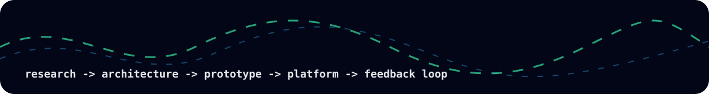
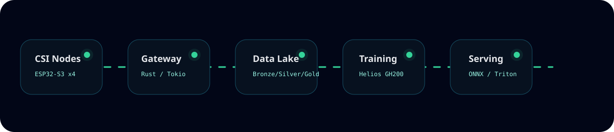
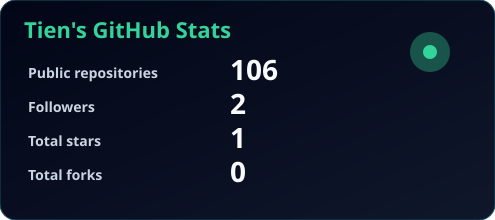
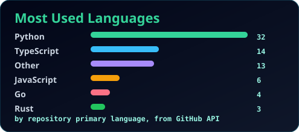
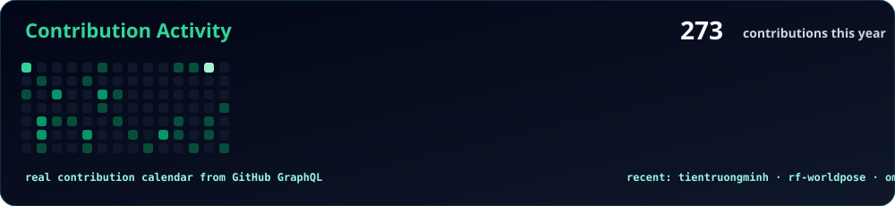

<div align="center">
  
</div>

<div align="center">

[](https://github.com/tientruongminh/rf-worldpose)
[](https://github.com/tientruongminh/omi_FE)
[](https://github.com/tientruongminh/nanobot_mod_by_MTCD)
[](#)
[](https://github.com/tientruongminh)
[](https://github.com/tientruongminh?tab=repositories)

</div>

<div align="center">
  
</div>

## About me

I am **Tien Truong Minh**, a third-year **Data Science student at HCMUS** and currently working in **AI Engineering at Amoiq**.

I like building AI systems that go beyond demos: agent runtimes, search orchestration, ML pipelines, RF sensing platforms, backend services, infinite-canvas products, and documentation that makes a project actually usable.

My current direction is clear: **turn research ideas into clean, production-oriented systems**.

<div align="center">
  
</div>

## GitHub command center

<div align="center">
  
</div>

<table>
<tr>
<td width="50%" valign="top">
  
</td>
<td width="50%" valign="top">
  
</td>
</tr>
<tr>
<td width="50%" valign="top">
  
</td>
<td width="50%" valign="top">
  
</td>
</tr>
</table>

<div align="center">
  
</div>

<div align="center">


</div>

## What I build

<table>
<tr>
<td width="50%" valign="top">

### AI systems and agents

I work on agent runtimes, skill systems, retrieval/search workflows, tool calling, memory, scheduling, and automation.

- [`nanobot_mod_by_MTCD`](https://github.com/tientruongminh/nanobot_mod_by_MTCD) — ultra-lightweight personal AI assistant direction
- [`Memento-Skills`](https://github.com/tientruongminh/Memento-Skills) — agent skill design and reusable capabilities
- [`agent_search`](https://github.com/tientruongminh/agent_search) — production-oriented agentic search baseline

</td>
<td width="50%" valign="top">

### Product interfaces and learning tools

I like visual systems: infinite canvas, graph learning, editor UX, AI chat in context, dashboards, and workflows that feel like products.

- [`omi_FE`](https://github.com/tientruongminh/omi_FE) — OmiLearn intelligent learning platform
- [`velo-editor`](https://github.com/tientruongminh/velo-editor) — AI coding editor direction
- [`flowboard`](https://github.com/tientruongminh/flowboard) — infinite canvas for AI product video workflows

</td>
</tr>
<tr>
<td width="50%" valign="top">

### ML and research platforms

I am interested in ML systems that include data contracts, dataset versions, evaluation gates, model packaging, deployment paths, and operating docs.

- [`rf-worldpose`](https://github.com/tientruongminh/rf-worldpose) — WiFi CSI sensing platform
- [`RuView`](https://github.com/tientruongminh/RuView) — WiFi DensePose / RF sensing direction
- [`wifi_depose_by_cd`](https://github.com/tientruongminh/wifi_depose_by_cd) — WiFi pose research work

</td>
<td width="50%" valign="top">

### Infrastructure-minded engineering

I care about the parts that make systems survive: APIs, workers, queues, databases, object storage, monitoring, Docker, Kubernetes, CI, runbooks, and rollback paths.

- Python, FastAPI, PyTorch
- Rust, Tokio, Go
- TypeScript, Next.js, React
- PostgreSQL, NATS, S3/MinIO
- Docker, Kubernetes, Prometheus

</td>
</tr>
</table>

## Selected repositories

| Repository | What it is | Stack / direction |
| --- | --- | --- |
| [`rf-worldpose`](https://github.com/tientruongminh/rf-worldpose) | Production/research platform for WiFi CSI human sensing and WiFi-only skeleton/DensePose inference | ESP32-S3, Rust/Tokio, FastAPI, Dagster, PyTorch, Helios GH200, ONNX, Triton |
| [`omi_FE`](https://github.com/tientruongminh/omi_FE) | Intelligent learning platform with infinite canvas, AI chat, quiz/flashcard/essay review, roadmap graphs, dashboard, collaboration | Next.js 16, React 19, TypeScript, Tailwind, Framer Motion, Zustand, React Flow |
| [`nanobot_mod_by_MTCD`](https://github.com/tientruongminh/nanobot_mod_by_MTCD) | Ultra-lightweight personal AI assistant inspired by OpenClaw, focused on compact agent runtime and extensibility | Python, providers, local models, scheduling, memory, multi-channel assistant workflows |
| [`agent_search`](https://github.com/tientruongminh/agent_search) | Agentic material search system with async jobs, query planning, retrieval, verification, ranking, and packaged results | FastAPI, Next.js, Dramatiq, Brave/GitHub/page retrieval, deterministic fallbacks |
| [`velo-editor`](https://github.com/tientruongminh/velo-editor) | AI coding editor direction inspired by open-source Cursor alternatives | TypeScript, editor UX, codebase agents, checkpoints, local/provider model flexibility |
| [`flowboard`](https://github.com/tientruongminh/flowboard) | Infinite canvas for AI product videos; visual node workflow for product, scene, model, and video generation | Python, AI workflow orchestration, canvas/product tooling |

## Current deep build: RF-WorldPose

<div align="center">
  
</div>

```text
ESP32-S3 CSI nodes
   -> CRC-protected UDP packets
      -> Rust/Tokio gateway
         -> SQLite local buffer + NATS JetStream
            -> MinIO/S3 Bronze archive
               -> Dagster ETL: Bronze -> Silver -> Gold
                  -> PyTorch RFWorldPose model
                     -> LoRA adapters + knowledge distillation
                        -> Helios GH200 Slurm training
                           -> MLflow + model cards + eval gates
                              -> ONNX edge inference / Triton cloud serving
```

## Toolbox

```text
AI / ML      PyTorch, dataset pipelines, evaluation gates, LoRA, distillation
Agents       tool calling, search orchestration, memory, skill systems, automation
Backend      FastAPI, Rust/Tokio, PostgreSQL, NATS, S3/MinIO, workers
Frontend     Next.js, React, TypeScript, Tailwind, infinite canvas, dashboards
Ops          Docker, Kubernetes, Prometheus, CI, runbooks, deployment docs
```


## GitHub stats from real data

These local cards are generated from the GitHub API by a scheduled GitHub Action, then rendered as SVG files in this repo. They are kept here as a real-data backup for the live stat widgets above.

<div align="center">
  
  
  <br />
  <br />
  
</div>

## Build philosophy

> Good AI products are not just prompts. They are data contracts, feedback loops, product surfaces, infrastructure, and reliability work hidden behind a simple experience.

I am still a student, but I want my projects to look and feel like serious engineering work: readable architecture, runnable commands, useful abstractions, clean docs, and enough polish that another engineer can understand the system without asking me to explain every file.
